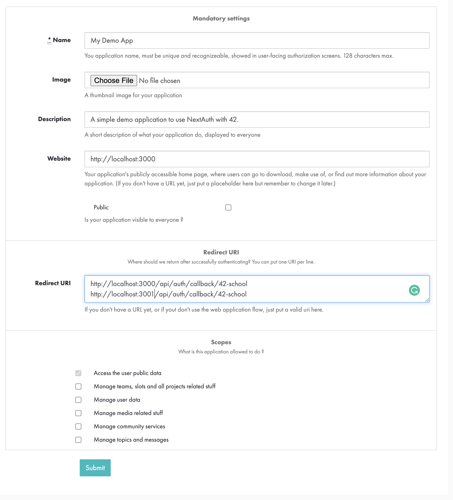
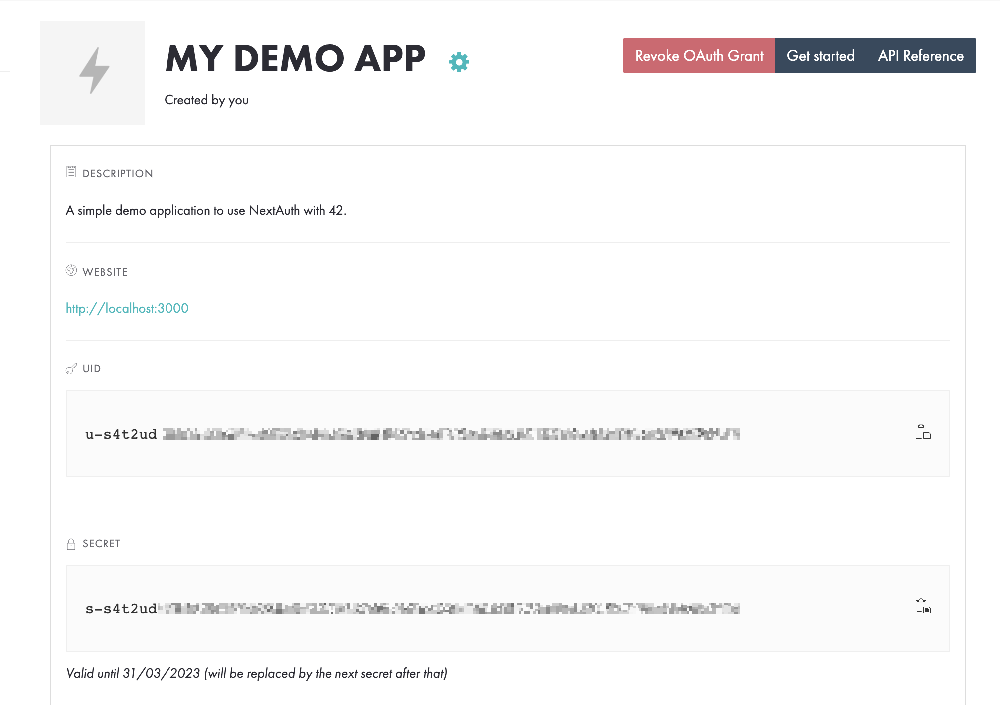

<h1 align="center"><code>ft_github</code></h1>

<div align="center">
  <sub>Created by <a href="https://github.com/jgengo">Jordane Gengo (Titus)</a></sub>
</div>
<div align="center">
  <sub>From <a href="https://hive.fi">Hive Helsinki</a></sub>
</div>

<br><br>


# Requirements

## Create a 42 OAuth applications

First of all, you will need to create a 42OAuth application. 
You can create your app from the intra [on this page](https://profile.intra.42.fr/oauth/applications/new)



**Redirect URI:** Add potential (and allowed) redirect URI per line.

You can use the same app for your dev and prod environment. However, the best practice is to create one for each environment (dev, staging and prod).

So for example your could add:
```
http://localhost:3000/api/auth/callback/42-school
http://localhost:3001/api/auth/callback/42-school
http://domain.nl/api/auth/callback/42-school
```

**Scopes:** You can check scopes you are might need (on behalf of the user). For instance if you want to create an application allowing one to schedule evaluations slots, you will need to check "Manage teams, slots and all projects related stuff". 

Submit!



After creating your app, you will be provided a client and secret that will need to be informed into .env


**To acknowledge:**

42central decided to create a secret rotation for security reasons, imposing you to rotate your secret every 30 days. 


**I highly encourage reading:**

- the [Getting started](https://api.intra.42.fr/apidoc/guides/getting_started) and [Guides](https://api.intra.42.fr/apidoc/guides) pages.
- the [API endpoints](https://api.intra.42.fr/apidoc).
- the JWT [Introduction](https://jwt.io/introduction) page.

# Steps by steps
TODO - will come soon

# Contributing

Please note that I'm not an expert in Next.js or the JavaScript ecosystem overall. 

However, I welcome contributions to make this repository a better reference for my peers. 

Your suggestions and input are always appreciated!


